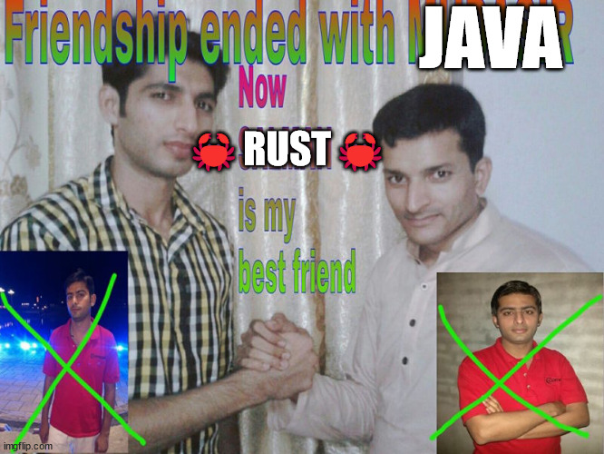

<h1 align="center">Why I Don't Like Java... Anymore</h1>

    

So...

> **I don't like Java anymore**

and honestly, I'm kinda bummed about it.

Java has the privilege (or not, depending on how you look at it) of being one of the first programming languages that I
interacted with. Throughout high-school, we were taught... the monstrosity that
is... [Visual Basic 2010 Express.](https://ludovic.chabant.com/devblog/2010/01/09/visual-studio-express-limitations-lead-to-bad-practices//ceiling_cat_vs_express.jpg)

_**shudders**_

Casting those years aside, java stormed it's in way into my life in my final years of high school through a foundation
apprenticeship that I was doing. I still vividly remember looking at some code on the lecturer's screen and thinking to
myself...

> What the f**k is going on? private static void wha? new Scanner()? oBjEcTs, what are those?

However, at the same time, I was... excited! Even though I didn't know how to define an Arraylist or read in files or
whatever, some part of me was excited _because_ I didn't know. It was an opportunity for me to learn and work towards
proficiency. Unfortunately, as of late, that feeling has increasingly shifted towards another language.

🦀 **Rust** 🦀

## It's not you... It's me!

TODO

(I've published this unfinished because... I'm a bad blog writer I guess :D)

- - - - 

 

    
    
    
    

