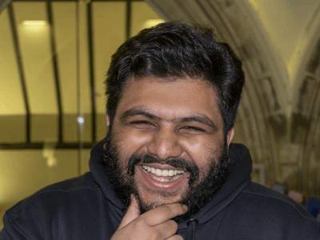

<h1 align="center">Hey 👋, I'm Goudham</h1>

    <h3>Software Engineer @ BBC   Second Year Graduate Apprentice @ University of Glasgow</h3>
    

Hiya! I've been putting off creating this little space _forever_ and just now finally getting around it. Massive thanks
to all the people who've worked on [mdBook](https://rust-lang.github.io/mdBook/) for creating such an intuitive tool for
creating websites through markdown.

The main motivations behind this space actually stem from one of my previous university lecturers. He sent me an article
exploring and explaining the idea of [digital gardening](https://maggieappleton.com/garden-history), and it immediately
piqued my interest.

> "Gardens present information in a richly linked landscape that grows slowly over time" - Maggie Appleton

My main motivation is definitely to try and turn this space into a **_digital garden_**.

### What do you do?

I am working within a JVM based team that focuses on programme metadata delivery utilizing microservice architecture in
a serverless manner.

> _o.O What?_ 

I help my team deliver TV & Non-TV schedules internally and externally with the help of Amazon Web Services.

> _I guess that's a little better..._

I let you know when EastEnders is on TV :D

> _Finally, he's speaking English!_

### What are your interests?

My personal interests vary _a lot_ but are currently focused towards systems design & low-level programming in languages
such as **C**, **Go** & _especially_ 🦀 **Rust** 🦀 so you can expect a lot of blog posts in that domain... whenever I
can be bothered to write them :P

 

- - - -

{{#include templates/footer.md}}