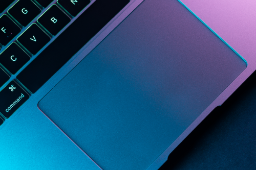

<h1 align="center">Personal Projects 🦀</h1>

    

I've developed quite a few projects over the last few years, varying from public libraries to command line applications,
and I've _always_ wanted a space other than github to showcase them... so here we are. I'll only be showcasing my
_absolute favourite_ ones here so please do check out my
[github](https://github.com/sgoudham?tab=repositories&type=source) to see all of them!

> **Warning**: The older ones have a _significant_ drop in quality compared to the more recent ones.

Alas, here's some of my favourite personal projects! (in no particular order!)

## uwuifyy

TODO

## rall

TODO

## bst-rs

TODO

## Winston

TODO

## MyClipboard

TODO

## MyWaifuWrapper

TODO

 

I wouldn't say any of the projects listed above are **that** impressive or mind-blowing, but they all have played a
pivotal role in building up the understanding that I have now. (And the understanding that I do have now is still so
minuscule - **cue existential-crisis aaaaaaaaaaaAAAAAAAAA**)

At the time of writing, I'm at the very beginning of my career, and I personally can't wait to develop further and dive into
more and more rabbit holes that working on these projects allows me too! And of course, I hope to bring _you_ along for
ride too. Watch this space :D

 

- - - -

    
    
    
    

